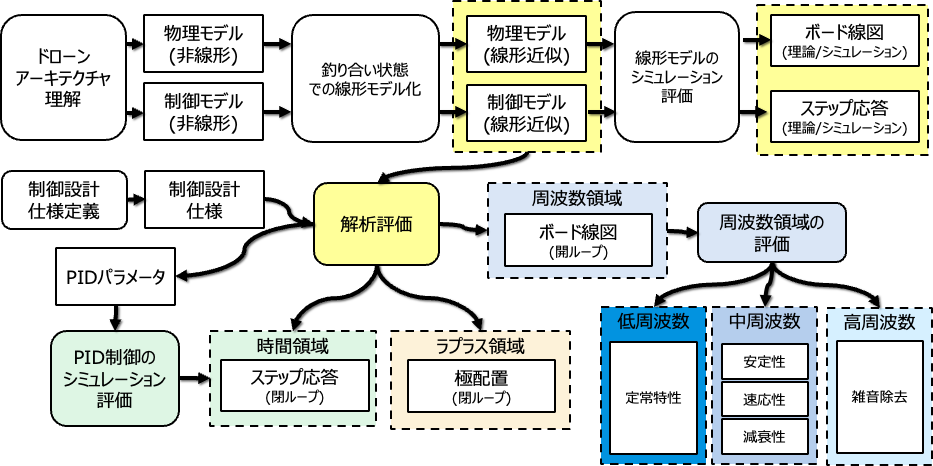
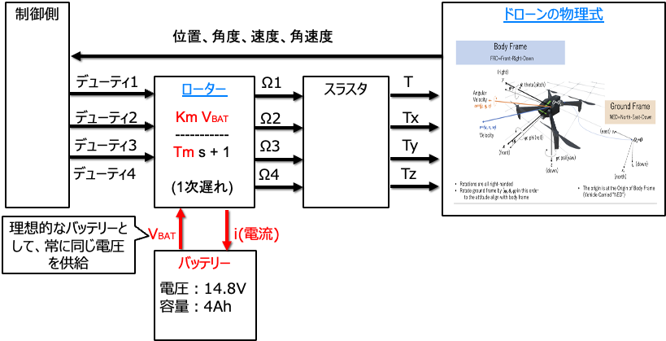
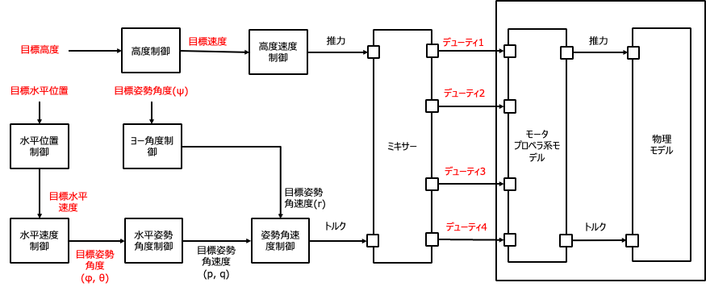
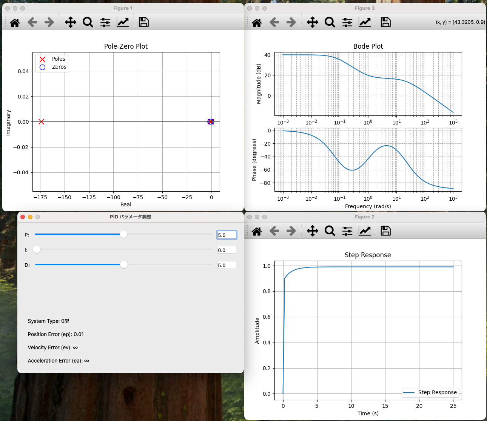

# hakoniwa-drone-education


本リポジトリでは、箱庭ドローンの数式を線形モデル化して、解析的にドローン制御のPIDパラメータを調査する方法をまとめています。

具体的には、こんなことができます。

- 解析的なPIDパラメータ調査手法としては、ボード線図や位相線図の作成からステップ応答解析などを Pythonライブラリで簡単に行えます。
- 解析的に求めたパラメータを箱庭ドローンシミュレータで動作確認できます。この際、遅延時間やオーバーシュート量などを定量的に評価できます。

箱庭ドローンの物理モデルは[こちら](https://github.com/toppers/hakoniwa-px4sim/blob/main/drone_physics/README-ja.md#%E6%95%B0%E5%BC%8F)。


現時点(2024/11/19)では、まだ開発中のステータスであり、[こちら](https://www.docswell.com/s/kanetugu2015/ZXE4D4-Hakoniwa-drone-control-engineering-environment)でその構想を説明しております。



# 目次

- [物理モデル](#物理モデル)
- [制御モデル](#制御モデル)
- [線形モデル解析](#線形モデル解析)
- 線形モデルのシミュレーション評価(TODO)
- 制御設計仕様定義(TODO)
- 解析評価(TODO)
  - ラプラス領域
  - 時間領域
  - 周波数領域
- PID制御シミュレーション評価(TODO)
- ツールの説明
  - [線形モデル解析手順](#線形モデル解析手順)
  - [箱庭ドローンシミュレータの環境構築手順](#箱庭ドローンシミュレータの環境構築手順)

# 物理モデル



# 制御モデル




# 線形モデル解析

箱庭ドローンおよび制御モデルの線形モデル化については、[こちら](docs/README.md)を参照してください。


# 線形モデル解析手順

線形モデル解析では、Pythonライブラリを利用します。

そのため、最初に、以下のコマンドでPythonライブラリをインストールしてください。

```bash
pip install -r requirements.txt
```

線形モデル解析は以下の２ステップで行います。

1. 解析的に求めた線形モデルの伝達関数を Json ファイルで定義する
2. 定義したJsonファイルの伝達関数を用いて、古典制御ベースの道具を用いて解析を行う

## 1. 解析的に求めた線形モデルの伝達関数を Json ファイルで定義する

[Json ファイルの作成手順](models/README.md)


## 2. 定義したJsonファイルの伝達関数を用いて、古典制御ベースの道具を用いて解析を行う


以下のコマンドを実行することで、線形モデル解析を行うことができます。

```bash
 python src/libs/pid_param_view.py models/expanded_models/expanded_control_alt_spd.json --uptime 100 --input_increment 0.01 --step --bode
```

成功すると、下図のように、ステップ応答とボード線図および極配置図が表示されます。



左下にあるPIDパラメータ調整を行うことで、ステップ応答やボード線図、極配置図が変化します。

本ツールの使い方の詳細は、helpを参照してください。

```bash
 python src/libs/pid_param_view.py -h
usage: pid_param_view.py [-h] [--uptime UPTIME] [--max_input_value MAX_INPUT_VALUE] [--input_increment INPUT_INCREMENT] [--step] [--bode] [--ny] [--p P] [--i I] [--d D] file_path

PID パラメータ調整とステップ応答

positional arguments:
  file_path             Transfer function JSONファイルのパス

options:
  -h, --help            show this help message and exit
  --uptime UPTIME       グラフ描画間隔。単位はmsecです
  --max_input_value MAX_INPUT_VALUE
                        入力可能な最大値
  --input_increment INPUT_INCREMENT
                        数値入力のステップサイズ
  --step                ステップ応答を表示するかどうか
  --bode                ボード線図と位相線図を表示するかどうか
  --ny                  ナイキスト線図を表示するかどうか
  --p P                 Pゲインのパラメータ名
  --i I                 Iゲインのパラメータ名
  --d D                 Dゲインのパラメータ名
```

# 箱庭ドローンシミュレータの環境構築手順

## サポート対象

- MacOS(AppleSilicon/Intel)
- Ubuntu 22.0.4
- Windows/WSL2


## 環境構築手順

本リポジトリーをクローンします。

```bash
git clone https://github.com/toppers/hakoniwa-drone-education.git
```

ワークスペースを作ります。

```bash
cd hakoniwa-drone-education && mkdir workspace
```

ワークスペースに移動します。

```bash
cd workspace
```

インストーラを起動します。

```
bash ../installer/install.bash
```

インストールが成功すると、以下のようになります。

```bash
% ls
hakoniwa-px4sim         hakoniwa-webserver      root                    setup.bash              static.webgl.zip
```

箱庭ドローンシミュレータのバイナリやコンフィグファイル類は、すべて `root` に入っています。
`setup.bash` は、環境変数定義ファイルです。ツール利用する際に `source` してください。

# シミュレーション評価時の準備

シミュレーション評価設定ファイルを作成します。

例：src/drone_evaluation/input/spd_z-step-input.json
```json
{
  "simulation": {
    "simulation_time_step": 0.001,
    "type": "controller",
    "controller_type": "spd_z",
    "signals": {
      "step1": {
        "type": "step",
        "parameters": {
          "comment": "target speed z : 1 m/sec",
          "offsets": [ 1 ]
        }
      },
      "step2": {
        "type": "step",
        "parameters": {
          "comment": "target speed z : 0 m/sec",
          "offsets": [ 0 ]
        }
      },
      "step3": {
        "type": "step",
        "parameters": {
          "comment": "target speed z : 1 m/sec",
          "offsets": [ 1 ]
        }
      }
    },
    "signal_input_timings": [
      {
        "name": "step1",
        "duration_sec": 99.0
      },
      {
        "name": "step2",
        "duration_sec": 100.0
      },
      {
        "name": "step3",
        "duration_sec": 100.0
      }
    ]
  },
  "evaluation": {
    "step_evaluation": {
      "config_params": {
        "AXIS": "Vz",
        "INVERT_AXIS": true,
        "EVALUATION_START_TIME": 200.0,
        "CONVERT_TO_DEGREE": false
      },
      "target_params": {
          "TARGET_TR": 2.0,
          "TARGET_TD": 1.01,
          "TARGET_OS": 0.04,
          "TARGET_TS": 5.49,
          "TARGET_VALUE": 1.0
      }
    },
    "input_data": {
      "log_file": "in.csv",
      "cache_len": 1024
    },
    "output_data": {
      "log_file": "drone_log0/drone_dynamics.csv"
    }
  }
}
```

詳細は、[シミュレーションと評価設定フォーマット](#シミュレーションと評価設定フォーマット) を参照してください。


# シミュレーション実行方法

```bash
cd workspace
```

```bash
source setup.bash
```

Z軸方向の速度制御の評価を実行する場合は、以下のコマンドを実行してください。
```bash
bash ../src/drone_evaluation/evaluate.bash ../src/drone_evaluation/input/spd_z-step-input.json
```

成功すると以下のようにログファイルが出力されます。

```bash
% ls drone_log0                                                                                    
drone_dynamics.csv      log_baro.csv            log_gps.csv             log_mag.csv             log_rotor_1.csv         log_rotor_3.csv
log_acc.csv             log_battery.csv         log_gyro.csv            log_rotor_0.csv         log_rotor_2.csv         log_thrust.csv
```

TODO: 結果の解析方法はペンディング中。

## PIDパラメータの変更方法

PIDパラメータは、以下に配置されていますので、適宜変更してください。

`src/drone_control/config/param-api-mixer.txt`


# シミュレーションと評価設定フォーマット

箱庭ドローンのシミュレーションと評価に使用されるJSON設定ファイルの構造について説明します。
このJSON設定ファイルを用いることで、シミュレーション条件や入力信号、評価基準を簡単に設定・変更することができます。以下に各項目の詳細を説明します。

---

## ルートキー
- **`simulation`**: シミュレーション環境および入力信号の設定を含むセクションです。
- **`evaluation`**: 評価基準および関連データファイルを指定するセクションです。

---

### `simulation` キー詳細

#### `simulation_time_step`
- **型**: `float`
- **説明**: シミュレーションの更新間隔（秒単位）。値を小さくするほど精度が向上しますが、計算負荷が増加します。推奨：0.001。

#### `type`
- **型**: `string`
- **説明**: シミュレーションの種類を指定します。制御モデルの評価の場合は `"controller"` を指定します。プラントモデルの評価開始の場合は `"plant"` を指定します。

#### `controller_type`
- **型**: `string`
- **説明**: `type` が `controller` の場合は、使用するコントローラー(src/drone_control/workspace)の種類を指定します。
- `"spd_z"`： AltSpeedController
- `"pos_z"`： PositionController
- `"pos"`： PositionController
- `"spd"`： SpeedController
- `"angle"`： AngleController

#### `signals`
- **型**: `object`
- **説明**: シミュレーションで使用する入力信号を定義します。それぞれの信号には名前、種類、パラメータが含まれます。

##### 信号の詳細
- **`type`**: 信号の種類
  - `"step"`: ステップ信号。急激な変化を与え、ステップ応答を確認するために使用します。
  - `"sine"`: サイン波信号。周期的な入力を与え、システムの周波数応答を確認するために使用します。
- **`parameters`**: 信号の種類に応じたパラメータ。
  - **`step`**:
    - **`offsets`**: ステップ信号のオフセット値（配列形式）。
  - **`sine`**:
    - **`amp`**: サイン波の振幅（配列形式）。
    - **`freq`**: サイン波の周波数（Hz、配列形式）。
    - **`offsets`**: サイン波のオフセット値（配列形式）。

#### `signal_input_timings`
- **型**: `array`
- **説明**: 各信号を適用するタイミングと継続時間を指定します。
- **項目**:
  - **`name`**: `signals` で定義された信号の名前。
  - **`duration_sec`**: 信号が適用される継続時間（秒単位）。


---

### `evaluation` キー詳細

ステップ応答とサイン波応答の評価基準を定義できます。

- [ステップ応答評価設定](#step_evaluation)
- [サイン波応答評価設定](#freq_evaluation)

---

#### `step_evaluation`
- **型**: `object`
- **説明**: ステップ応答の評価基準を定義します。

##### `config_params`
評価設定パラメータ：
- **`AXIS`**: 評価対象の軸（例: `"Vz"` はZ軸方向の速度）。
- **`INVERT_AXIS`**: 軸の向きを反転するかどうか（`true` または `false`）。
- **`EVALUATION_START_TIME`**: 評価を開始する時間（秒単位）。
- **`CONVERT_TO_DEGREE`**: 値を度に変換するかどうか（`true` または `false`）。

##### `target_params`
評価の目標値：
- **`TARGET_TR`**: 立ち上がり時間（秒単位）。
- **`TARGET_TD`**: 遅延時間（秒単位）。
- **`TARGET_OS`**: オーバーシュート率。
- **`TARGET_TS`**: 定常時間（秒単位）。
- **`TARGET_VALUE`**: システムが到達すべき目標値。

#### `input_data`
- **型**: `object`
- **説明**: `signals` で定義した信号時系列データをファイル出力するための情報。

##### `log_file`
- **型**: `string`
- **説明**: シミュレーションで入力した信号時系列データを保存するファイル名。

##### `cache_len`
- **型**: `integer`
- **説明**: シミュレーション実行速度調整用のパラメータでありこのサイズ単位でファイル保存する。

#### `output_data`
- **型**: `object`
- **説明**: シミュレーション結果として評価対象とするファイル名を指定します。

##### `log_file`
- **型**: `string`
- **説明**: シミュレーション結果として評価対象とするファイルのパス。


以下の形式で、サイン波信号（`sine`）用の評価設定を追加します。

---

#### `freq_evaluation`
- **型**: `object`
- **説明**: サイン波応答の評価基準を定義します。

##### 評価設定パラメータ：
- **`freq`**:
  - **型**: `float`
  - **説明**: 評価対象のサイン波の周波数（Hz）。
- **`output_inverse`**:
  - **型**: `boolean`
  - **説明**: 出力の符号を反転するかどうか。`true` で反転、`false` でそのまま評価します。
- **`start_time`**:
  - **型**: `float`
  - **説明**: 評価を開始するシミュレーション時間（秒単位）。

#### `input_data`
- **型**: `object`
- **説明**: サイン波入力信号に関連する評価データの設定。

##### 評価設定パラメータ：
- **`log_file`**:
  - **型**: `string`
  - **説明**: 入力信号の時系列データを保存するファイル名。
- **`axis`**:
  - **型**: `string`
  - **説明**: 評価対象の入力信号軸（例: `"target_vz"`）。
- **`max_val`**:
  - **型**: `float`
  - **説明**: 入力信号の最大値を指定します。
- **`cache_len`**:
  - **型**: `integer`
  - **説明**: 入力データのキャッシュサイズ。このサイズ単位でデータを保存します。

#### `output_data`
- **型**: `object`
- **説明**: サイン波応答データの評価設定。

##### 評価設定パラメータ：
- **`log_file`**:
  - **型**: `string`
  - **説明**: 出力信号の時系列データを保存するファイル名。
- **`axis`**:
  - **型**: `string`
  - **説明**: 評価対象の出力信号軸（例: `"Vz"`）。

---
