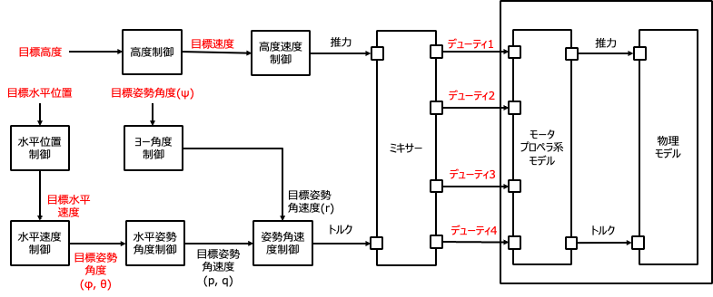
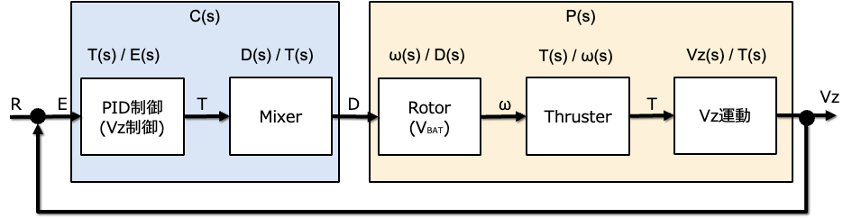
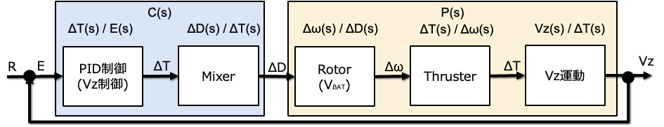

# はじめに

ここでは、箱庭ドローンシミュレータの物理モデルおよび制御モデルを解析するための情報を整理しています。

# プラントモデル

## 物理モデル

ドローンの物理モデルは、以下を参照ください。

https://github.com/toppers/hakoniwa-px4sim/tree/main/drone_physics#equations

## モータプロペラ系モデル

モータプロペラ系モデルは、以下を参照ください。

https://www.docswell.com/s/Kouhei_Ito/K38V1P-2024-02-10-094123#p125

# 制御モデル

箱庭ドローンシミュレータ内の制御モデルは、以下のアーキテクチャです。制御部分はそれぞれPID制御を行います。

# モデル化

まずは、Vzの制御を考えます。

これに対して、釣り合い位置で線形近似した制御を考えます。

- [PID制御(Vz制御)](#pid制御vz制御のモデル化)
- [Mixer](#ミキサーの線型モデル化)
- [Rotor](#モータプロペラ系のモデルの線形モデル化)
- [Thruster](#スラスタ推力の線形モデル化)
- [Z軸速度](#z軸速度方向の線形モデル化)

## PID制御(Vz制御)のモデル化

**時間領域**

$T(t) = mg + K_p e(t) + K_i \int_0^t e(\tau) d\tau + K_d \dot{e(t)}$

$e(t) = r(t) - y(t)$

- $T(t)$ : 制御入力
- $e(t)$ : 偏差
- $r(t)$ : 目標値
- $y(t)$ : 出力値
- $m$ : 質量
- $g$ : 重力加速度
- $K_p$ : 比例ゲイン
- $K_i$ : 積分ゲイン
- $K_d$ : 微分ゲイン

$T(t) = T_0 + \Delta T(t)$

として、釣り合いの式を考えると、以下の通りとなる。

$T_0 = mg$ であるため、

$\Delta T(t) =  K_p e(t) + K_i \int_0^t e(\tau) d\tau + K_d \dot{e(t)}$

**ラプラス領域**

$\Delta T(s) = K_p  E(s) + K_i \frac{1}{s}  E(s) + K_d s  E(s)$

これを伝達関数にすると以下の通り。

$G_{\Delta T}(s) = \frac{\Delta T(s)}{E(s)} = K_p + \frac{K_i}{s} + K_d s$

## ミキサーの線型モデル化

Z軸方向の移動のみを考えた場合、トルクを０とできる。この場合、回転数と推力の関係は以下の通りとなる。

$\omega^2 = \frac{T(t)}{N C_t}$

ホバリング状態からの変化量の観点で記述すると、以下のようになり、

$\omega = \omega_{0} + \Delta \omega$

$(\omega_{0} + \Delta \omega)^2 = \frac{T_0 + \Delta T(t)}{N C_t}$

$\omega_{0}^2 + 2 \omega_{0} \Delta \omega + \Delta \omega^2 = \frac{T_0 + \Delta T(t)}{N C_t}$

ここで、 $\Delta \omega$ の２次の項を無視し、さらに釣り合いの式を与えると、 $\omega_{0}^2 = \frac{T_0}{N C_t}$ であるため、以下の通りとなる。

$2 \omega_{0} \Delta \omega = \frac{ \Delta T(t)}{N C_t}$

伝達関数で表すと以下の通りとなり、スラスタと逆の伝達関数となる。

$G_{\Delta \omega}(s) = \frac{\Delta \omega(s)}{\Delta T(s)} = \frac{1}{2 N C_t \omega_{0}}$

ここで、デューティ値と回転数の関係式を求める。

まず、デューティ値と回転数の関係は以下の通りとなる。

$d = \frac{e}{V_{BAT}}$

$e = K \omega+(C_q R / K ) \omega ^2$

さらに、ホバリング状態では、 以下の通りである。

$d_0 = e_0/V_{bat}$

$e_0 = K \omega_0+(C_q R / K ) \omega_0 ^2$

ここで、ホバリング状態からの変化量という記述をする場合、以下のようになる。

$\omega = \omega_0 + \Delta \omega$

$e = K ( \omega_0 + \Delta \omega)+(C_q R / K ) ( \omega_0 + \Delta \omega) ^2$

２次の項を無視すると、以下の通りとなる。

$e = (K \omega_0 + \frac{C_q R}{K} \omega_0^2) + (K \Delta \omega+ \frac{C_q R}{K} 2 \Delta \omega)$

よって、デューティと回転数の関係は以下の通りとなる。

$d0 + \Delta d = \frac{e0 +  (K \Delta \omega+ \frac{C_q R}{K} 2 \Delta \omega)}{V_{BAT}}$

$\Delta d = \frac{K + \frac{2 C_q R}{K}  }{V_{BAT}}\Delta \omega$

$\frac{\Delta d}{\Delta \omega} = \frac{K^2 + 2 C_q R  }{K V_{BAT}}$

ここで、

$G_{\Delta \omega}(s) = \frac{\Delta \omega(s)}{\Delta T(s)} = \frac{1}{2 N C_t \omega_{0}}$

を思い出して、デューティの伝達関数を考えると、以下の通りとなる。

$G_{\Delta d(s)} = \frac{\Delta d(s)}{\Delta T(s)} =  \frac{\Delta \omega(s)}{\Delta T(s)} \frac{\Delta d(s)}{\Delta \omega(s)}  = \frac{1}{2 N C_t \omega_{0}} \frac{K^2 + 2 C_q R  }{K V_{BAT}}$

最後に、 $K_m$ の定義を使うと、以下の通りとなる。

$G_{\Delta d(s)} =  \frac{1}{2 N C_t \omega_{0}} \frac{1}{K_m V_{BAT}}$

## モータプロペラ系のモデルの線形モデル化

**モータプロペラの運動方程式：**

$J \dot{\omega} + C_Q \omega^2 = K i$

- $J$ : モーターイナーシャ[ $kg m^2$ ]
- $C_Q$ : トルク係数 [ $Nms^2/rad^2$ ]
- $K$ : ローターのトルク定数。[ $Nm/A$ ]
- $i$ : モータ電流 [ $A$ ]
- $\omega$ : 角速度[ $rad/s$ ]

**電気の方程式：**

$R i + K \omega = e$

- $R$ : モータ抵抗[ $\Omega$ ]
- $e$ : 誘起モーターに印加される電圧[ $V$ ]

モータプロペラの非線形モデル：

$J \dot{\omega} + \frac{K^2}{R} \omega + C_Q \omega^2 = \frac{K}{R} e$

ホバリング状態からの変化量という記述をする場合、以下のようになり、

$\omega = \omega_0 + \Delta \omega$

$e = e_0 + \Delta e$

ここで、ホバリン状態の釣り合いの式は以下の通りとなる。

$\frac{K^2}{R} \omega_0 + C_Q \omega_0^2 = \frac{K}{R} e_0$

ホバリング状態は速度の変化はない退場状態なので微分項は0となる。

ホバリング状態を表す釣り合いの式は以下の通りとなる。

$J \dot{\Delta \omega} + \frac{K^2}{R} (\omega_0 + \Delta \omega) + C_Q (\omega_0 + \Delta \omega)^2 = \frac{K}{R} (e_0 + \Delta e)$

この式は、釣り合いの式と照らし合わせて削除できる項があり、以下の通りとなる。

**線形化されたモータープロペラ系のモデル**

$J \dot{\Delta \omega} + ( \frac{K^2}{R} + 2 C_Q \omega_0 ) \Delta \omega = \frac{K}{R} \Delta e$

ラプラス変換すると以下の通り。

$J s \Delta \omega(s) + ( \frac{K^2}{R} + 2 C_Q \omega_0 ) \Delta \omega(s) = \frac{K}{R} \Delta e(s)$

伝達関数で表すと以下の通り。

$G_{\Delta \omega}(s) = \frac{\Delta \omega(s)}{\Delta e(s)} = \frac{K}{J R s + (K^2 + 2 R C_Q \omega_0)}$

ここで、一次遅れ系の伝達関数表現で表すと、

$\tau_m = \frac{J R}{K^2 + 2 R C_Q \omega_0}$

$K_m = \frac{K}{K^2 + 2 R C_Q \omega_0}$

$G_{\Delta \omega}(s) = \frac{K_m}{\tau_m s + 1}$

- $\tau_m$ : 時定数
- $K_m$ : ゲイン

さらに、デューティーと電圧の関係は以下の通り。

$\Delta e = V_{BAT} \Delta d$

- $V_{BAT}$ : 電源電圧
- $\Delta d$ : デューティー

デュティーを入力とした回転数の伝達関数は以下の通りとなる。

$G_{\Delta \omega}(s) = \frac{\Delta \omega (s)}{\Delta d(s)} = \frac{K_m V_{BAT}}{\tau_m s + 1}$

## スラスタ（推力）の線形モデル化

$T(t) = N C_t \omega^2$

- N : プロペラの数
- $C_t$ : 推力係数 [ $Ns^2/rad^2$ ]

ホバリング状態からの変化量という記述をする場合、以下のようになり、

$T_0 = N C_t \omega_0^2$

代入すると、

$T_0 + \Delta T(t) = N C_t (\omega_0 + \Delta \omega)^2$

$T_0 + \Delta T(t) = N C_t (\omega_0^2 + 2 C_t \omega_0 \Delta \omega + C_t \Delta \omega^2)$

二次の項を無視すると、

$T_0 + \Delta T(t) = N C_t (\omega_0^2 + 2 C_t \omega_0 \Delta \omega)$

さらに、 $T_0$ はホバリング推力であり、 $T_0 = N C_t \omega_0^2$ であるため、

$T_0 + \Delta T(t) = T_0 + 2 N C_t \omega_0 \Delta \omega$

となって、相殺される。

$\Delta T(t) = 2 N C_t \omega_0 \Delta \omega$

ラプラス変換すると以下の通り。

$\Delta T(s) = 2 N C_t \omega_0 \Delta \omega(s)$

伝達関数で表すと以下の通り。

$G_{\Delta T}(s) = \frac{\Delta T(s)}{\Delta \omega(s)} = 2 N C_t \omega_0$

## Z軸速度方向の線形モデル化

ロール、ピッチ、ヨー角度は０として、Z軸方向の速度のみを考える。

**時間領域**

$\dot{V_z} = -\frac{T(t)}{m} + g - \frac{D_z}{m} V_z$

- $V_z$ : Z軸方向の速度
- $T(t)$ : 推力
- $m$ : 質量
- $g$ : 重力加速度
- $D_z$ : 空気抵抗

ホバリング状態からの変化量という記述にすると以下の通り。

$\dot{V_z} = -\frac{T_0 + \Delta T(t)}{m} + g - \frac{D_z}{m} V_z$

$T_0$ : ホバリング推力であり、$T_0 = mg$ より、

$\dot{V_z} = -\frac{\Delta T(t)}{m} - \frac{D_z}{m} V_z$

**ラプラス領域**

$sV_z(s) = -\frac{\Delta T(s)}{m} - \frac{D_z}{m} V_z(s)$

伝達関数で表すと以下の通り。

$G_{V_z}(s) = \frac{V_z(s)}{\Delta T(s)} = \frac{-1}{ms + D_z}$

# Z軸速度制御の伝達関数

## 開ループ伝達関数

- コントローラの伝達関数
  - $G_{\Delta T}(s) = \frac{\Delta T(s)}{E(s)} = \frac{s^2 K_d + s K_p + K_i}{s}$
  - $G_{\Delta d(s)} = \frac{\Delta d(s)}{\Delta T(s)} = \frac{1}{2 N C_t \omega_{0}} \frac{1}{K_m V_{BAT}}$
- プラントの伝達関数
  - $G_{\Delta \omega}(s) = \frac{\Delta \omega (s)}{\Delta d(s)} = \frac{K_m V_{BAT}}{\tau_m s + 1}$
  - $G_{\Delta T}(s) = \frac{\Delta T(s)}{\Delta \omega(s)} = 2 N C_t \omega_0$
  - $G_{V_z}(s) = \frac{V_z(s)}{\Delta T(s)} = \frac{-1}{ms + D_z}$

$L(s) = \frac{V_z(s)}{E(s)} = - \frac{s^2 K_d + s K_p + K_i}{ s (ms + D_z)(\tau_m s + 1)}$

